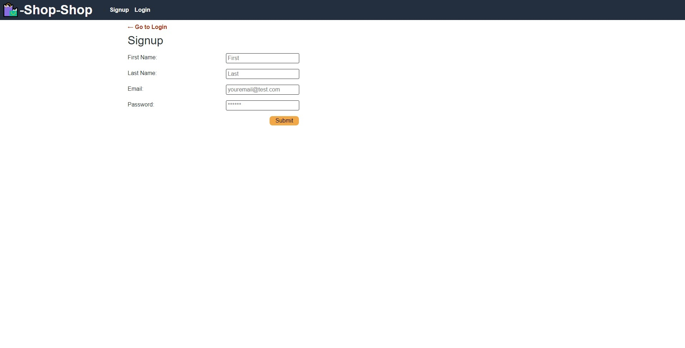
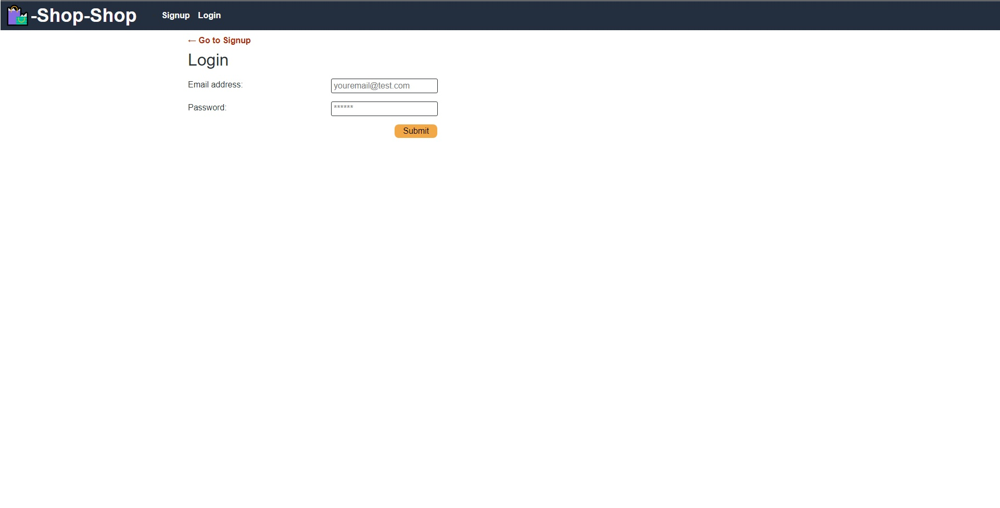
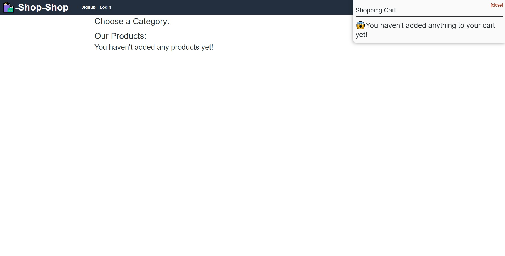

# Shop-Shop

## Deployed Application
[Heroku Link](https://guarded-headland-77866.herokuapp.com/)

## GitHub Repository
[Github Link](https://github.com/Ericcrain77/shop-shop)

## Licensing

## Table of Contents
* [Description](#description)
* [User Story](#user-story)
* [Screenshots](#screenshots)
* [Technologies](#technologies)
* [Questions](#questions)

## Description
An E-Commerce MERN Stack project that utilizes Redux instead of the React Context API to manage the Global State. 

## USER STORY
AS a senior engineer working on an e-commerce platform

I WANT my platform to use Redux to manage global state instead of the Context API

SO THAT my website's state management is taken out of the React ecosystem

## Screenshots
### Sign Up Page

### Login Page

### Landing Page with Cart

## Technologies
This application utilizes the following:
* concurrently
* apollo server
* bcrypt
* express
* graphql
* jsonwebtoken
* jwt-decode
* mongoose
* stripe
* nodemon

## Questions
Reach out to me using my [Github account](https://github.com/Ericcrain77) or my [email](ericcrain77@gmail.com).